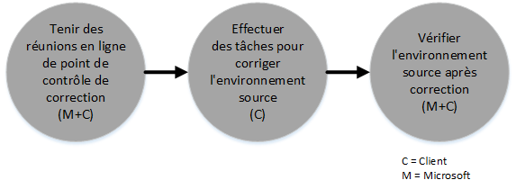

# Processus de l’offre du centre FastTrack pour Azure Rights Management
Si votre organisation est éligible à l’offre du centre FastTrack pour Azure Rights Management, vous pouvez travailler à distance avec des spécialistes Microsoft pour obtenir un environnement Azure RMS prêt à l’utilisation. Pour savoir si votre organisation est éligible, consultez [Offre du centre FastTrack pour Azure Rights Management](../Topic/FastTrack_Center_Benefit_for_Azure_Rights_Management.md).

Cet article fournit les informations suivantes :

-   [Overview of the onboarding process](#overview_rms)

-   [Expectations for your source environment](#expectations_src_environ_rms)

-   [Phases of the onboarding process](#phases_onboarding_process_rms)

-   [Microsoft responsibilities](#microsoft_responsibilities_rms) pour chaque phase

-   [Your responsibilities](#your_responsibilities_rms) pour chaque phase

Voici ce à quoi vous pouvez vous attendre quand l'intégration est terminée :

-   Votre locataire Microsoft Azure RMS est créé.

-   Les titulaires d’une licence d’utilisation peuvent accéder aux services Azure RMS en utilisant une des options d’identité suivantes :

    -   Identités cloud (comptes Microsoft Azure AD uniques).

    -   Identités synchronisées : comptes Microsoft Azure AD synchronisés à partir de votre annuaire Active Directory local avec l’outil Azure Active Directory Connect (Azure AD Connect) pour les clients avec une seule forêt ou plusieurs forêts Active Directory.

    -   Identités fédérées : avec des comptes Microsoft Azure AD qui sont :

        -   synchronisés à partir d'Active Directory avec l'outil Microsoft Azure AD Connect pour les clients avec une configuration de forêt Active Directory unique ;

        -   fédérés avec Active Directory Federation Services (ADFS) 2.0 ou version ultérieure à partir de votre annuaire Active Directory local.

## Vue d'ensemble du processus d'intégration
L'intégration présente deux composants majeurs :

-   **Fonctionnalités principales** : tâches requises pour la configuration du client et l'intégration à Azure AD, si nécessaire. Les fonctionnalités principales fournissent également la base de référence pour l’intégration d’autres services éligibles de Microsoft Online.

-   **Intégration de service** : tâches nécessaires pour configurer Azure RMS autonome, ou avec la synchronisation d’annuaires Azure AD Connect ou AD FS.

Le diagramme suivant décrit la chronologie de l’utilisation de l’offre du centre FastTrack.

Le processus de base se présente comme suit :

-   Microsoft essaie de vous contacter dans les 30 jours suivant votre achat d’un plan éligible. Vous pouvez également demander de l’aide à partir du [Centre FastTrack](http://fasttrack.microsoft.com/) si vous êtes prêt à déployer ces services pour votre organisation. Pour demander de l’aide, connectez-vous au Centre FastTrack (http://fasttrack.microsoft.com), accédez au tableau de bord, sélectionnez le nom de votre entreprise, cliquez sur l’onglet Offres et sur le bouton de demande d’assistance pour le service éligible.

-   L’équipe Microsoft vous apporte son aide pour les fonctionnalités principales, puis pour l’intégration de chaque service éligible.

L'assistance en matière d'intégration est assurée à distance par le personnel désigné de Microsoft :

-   Microsoft vous aide à distance pour de nombreuses activités d'intégration, en utilisant une combinaison d'outils, de documentation et de conseils. Si vous souhaitez que Microsoft effectue certaines tâches de configuration pour vous, vous pouvez choisir de fournir un accès et des autorisations appropriés à Microsoft.

-   L'assistance en matière d'intégration est fournie par le centre FastTrack, et est disponible pendant les heures normales de bureau d'une région donnée.

-   Elle est disponible dans les langues suivantes : chinois traditionnel, anglais, français, allemand, italien, japonais, portugais (Brésil) ou espagnol.

-   L’équipe Microsoft peut travailler directement avec vous ou avec votre représentant, que vous pouvez désigner.

## Attentes concernant votre environnement source
Vous avez peut-être déjà Microsoft Active Directory en local dans votre environnement source, que vous voulez intégrer à Microsoft Azure Active Directory pour tirer parti de la gestion des identités à partir d’une seule console. L’offre du centre FastTrack comprend une aide pour intégrer Microsoft Azure Active Directory à votre implémentation locale existante. Si l'intégration est nécessaire, votre environnement source doit être à un niveau minimal pour cette application.

Le tableau suivant indique les conditions attendues dans votre environnement source existant pour l'intégration.

|Activité|Attente concernant l'environnement source|
|------------|---------------------------------------------|
|Fonctionnalités principales|Forêts Active Directory avec le niveau de forêts fonctionnel défini sur Windows Server 2008 ou version ultérieure, avec la configuration de forêts suivante :  -   Forêt Active Directory unique -   Plusieurs forêts Active Directory **Note:** Pour toutes les configurations à plusieurs forêts, le déploiement AD FS n’entre pas dans le cadre de l’offre du centre FastTrack.|
|Intégration de service  -   Azure RMS|L’annuaire Active Directory et l’environnement locaux ont été préparés pour Azure RMS, ce qui inclut la correction des problèmes identifiés susceptibles d’empêcher l’intégration aux fonctionnalités Azure AD et Azure RMS.|

## Phases du processus d'intégration
L’intégration d’Azure RMS comporte cinq phases principales, comme illustré dans la figure suivante :

-   Initier

-   Évaluer

-   Corriger

-   Activer

-   Fermer

Pour connaître les tâches détaillées pour chaque phase, consultez les sections [Microsoft responsibilities](#microsoft_responsibilities_rms) et [Your responsibilities](#your_responsibilities_rms).

### Phase de lancement
Après avoir acheté le nombre approprié de licences, suivez la procédure figurant dans l’e-mail de confirmation d’achat pour associer ces licences à votre locataire existant ou à un nouveau locataire. Microsoft vérifie votre éligibilité à l’offre du centre FastTrack. Microsoft essaie de vous contacter dans les 30 jours suivant votre achat d’un plan éligible. Vous pouvez également demander de l’aide à partir du [Centre FastTrack](http://fasttrack.microsoft.com/) si vous êtes prêt à déployer ces services pour votre organisation. Pour demander de l’aide, connectez-vous au Centre FastTrack (http://fasttrack.microsoft.com), accédez au tableau de bord, sélectionnez le nom de votre entreprise, cliquez sur l’onglet Offres et sur le bouton de demande d’assistance pour le service éligible.

Pendant cette phase, nous aborderons le processus d'intégration, vérifierons les données et organiserons une réunion de lancement.

### Phase d'évaluation
Une fois le processus d'intégration démarré, Microsoft travaillera avec vous pour évaluer votre environnement source et les conditions requises. Des outils seront exécutés afin d'évaluer votre environnement et Microsoft vous guidera tout au long de l'évaluation de votre annuaire Active Directory local, de vos navigateurs Internet, des systèmes d'exploitation des appareils clients, de votre service DNS, de votre réseau, de votre infrastructure et de votre système d'identité, afin de déterminer si des changements sont nécessaires pour l'intégration. En fonction de votre configuration actuelle, nous vous fournirons un plan de correction qui adaptera votre environnement source aux conditions minimales requises pour la réussite de l’intégration à Azure RMS. Nous mettrons également en place des appels de point de contrôle appropriés pour la phase de correction.

### Phase de correction
Si nécessaire, vous effectuerez les tâches figurant dans le plan de correction dans votre environnement source de façon à pouvoir remplir les conditions requises pour l'intégration de chaque service.

Avant de commencer la phase d'activation, nous vérifierons ensemble les résultats des activités de correction pour nous assurer que vous pouvez continuer.

### Phase d'activation
Une fois toutes les activités de correction terminées, le projet passe à la configuration de l’infrastructure de base pour la consommation de services et à l’approvisionnement d’Azure RMS.

**Phase d'activation - Fonctionnalités principales**

L'activation des fonctionnalités principales implique l'approvisionnement de services et l'intégration du client et de l'identité. Elle comprend également des étapes de création d’une base pour l’intégration de Microsoft Azure RMS.

L’intégration d’Azure RMS peut commencer quand l’intégration de base est terminée.

**Phase d’activation – Azure RMS**

L’environnement Azure RMS peut être configuré si nécessaire avec la synchronisation d’annuaires Azure AD Connect et les services AD FS (Active Directory Federation Services).

Pour les scénarios Azure RMS qui incluent la synchronisation des identités locales vers le cloud, nous vous aidons en ajoutant des utilisateurs et des administrateurs informatiques à votre abonnement, en validant vos principaux cas d’usage pour le service, ainsi qu’en configurant l’environnement de gestion minimal, Azure RMS, la synchronisation d’annuaires à l’aide d’Azure AD Connect, les services AD FS à l’aide d’Azure AD Connect et des utilisateurs de test.

Le programme d’installation d’Azure RMS inclut l’activation des fonctionnalités suivantes :

-   Activation du service RMS

-   Configuration d’IRM pour Exchange Online et Sharepoint Online

-   Connecteur Rights Management avec Exchange sur site et Sharepoint sur site

-   Application de partage RMS pour les appareils Windows et non-Windows

## Responsabilités de Microsoft

### Général

-   Nous vous offrirons une assistance technique à distance pour les activités de configuration obligatoires, comme décrit dans les descriptions détaillées des phases.

-   Nous fournirons la documentation disponible et les outils logiciels, les consoles d'administration ainsi que des scripts pour vous aider à réduire ou éliminer les tâches de configuration.

Vous n’avez pas besoin de fournir un accès et des autorisations à Microsoft pour utiliser l’offre du centre FastTrack. Dans certains cas, vous pouvez choisir d'octroyer à Microsoft l'accès et les autorisations appropriés pour qu'il effectue des actions spécifiques à votre place.

### Phase de lancement

-   Vous contacter dans les 30 jours suivant l'achat de licences éligibles pour un nouveau client.

-   Définir les services éligibles que vous souhaitez intégrer.

### Phase d'évaluation

-   Fournir un aperçu administratif.

-   Fournir des conseils à propos des éléments suivants :

    -   DNS, réseau et besoins en infrastructure.

    -   Besoins du client (navigateur Internet, système d'exploitation client et besoins des services).

    -   Identité utilisateur et approvisionnement.

    -   Identification des besoins en termes de synchronisation d'annuaires.

    -   Activation des services éligibles qui ont été achetés et définis comme faisant partie de l’intégration.

    -   Identification des spécifications requises pour l’environnement de pilotage et de test.

-   Établir la chronologie des activités de correction.

-   Fournir une liste de contrôle de correction.

### Phase de correction

-   Tenir des téléconférences avec vous en fonction du calendrier convenu, afin d'examiner la progression des activités de correction.

-   Vous aider à exécuter des outils permettant d'identifier et de résoudre les problèmes, et vous aider à interpréter les résultats.

### Phase d'activation
Fournir des conseils à propos des éléments suivants :

-   Activation de votre locataire Azure RMS.

-   Configuration des ports de pare-feu.

-   Configuration du service DNS pour les services éligibles.

-   Validation de la connexion aux services Azure RMS.

-   Pour un environnement à forêt unique :

    -   Installation d'une synchronisation d'annuaires entre vos services de domaine Active Directory et Azure AD Connect, si nécessaire.

    -   Configuration de la synchronisation de mot de passe avec l'outil Azure AD Connect.

-   Pour un environnement à plusieurs forêts :

    -   Installation de la synchronisation d’Azure AD Connect, configurée pour des scénarios à plusieurs forêts. Notez que l'écriture différée de mot de passe et la synchronisation de hachage de mot de passe prennent en charge les scénarios à plusieurs forêts.  Toutefois, les autres scénarios d'écriture différée ne sont pas pris en charge.

    -   Configuration de la synchronisation entre les forêts Active Directory locales et l’annuaire Microsoft Azure AD (Azure Active Directory).

        > [!NOTE]
        > Le développement et l'implémentation des extensions de règles personnalisées sont hors de portée.

-   Pour une forêt unique quand des identités fédérées sont ciblées : installation et configuration des services AD FS pour l’authentification de domaine local avec Microsoft Azure AD dans une configuration avec un seul site et à tolérance de panne, si nécessaire.

    > [!NOTE]
    > Pour toutes les configurations à plusieurs forêts, les déploiements AD FS sont hors de portée.

-   Test de la fonctionnalité d'authentification unique, si elle est déployée.

-   Ajout d’administrateurs de la sécurité des informations supplémentaires pour gérer les modèles.

-   Affectation d’un compte de super utilisateur à Azure RMS.

-   Attribution d’une licence à deux utilisateurs pilotes pour Azure RMS.

-   Configuration de deux groupes de distribution de test pour valider les stratégies.

-   Configuration d’un modèle Azure RMS personnalisé pour votre annuaire.

-   Aide pour la configuration de l’intégration de SharePoint Online et Exchange Online à Azure RMS, y compris :

    -   Configuration et validation de l’intégration d’Exchange Online à Azure RMS.

    -   Définition d’une règle de flux de messagerie de test pour chiffrer les messages sensibles envoyés à des destinataires en dehors de votre organisation.

    -   Configuration et validation de la protection de SharePoint Online d’une bibliothèque de test à protéger avec Azure RMS.

-   Configuration d’un serveur local avec le connecteur RMS, quand c’est applicable :

    -   Configuration et validation de l’intégration d’Exchange 2013/2010 local à Azure RMS.

    -   Définition d’une règle de flux de messagerie de test pour chiffrer les messages sensibles envoyés à des destinataires en dehors de votre organisation à l’aide du connecteur.

    -   Configuration et validation de la protection de SharePoint 2013/2010 local d’une bibliothèque de test à protéger avec Azure RMS.

-   Configuration d’une application de partage RMS pour les appareils Windows et non-Windows.

## Vos responsabilités
Cette section décrit certaines de vos responsabilités au cours du processus d'intégration.

### Général

-   Toutes les améliorations et intégrations de votre locataire Azure RMS, en plus des options configurables répertoriées dans cet article.

-   Gestion globale des projets et des programmes concernant vos ressources.

-   Communications avec l'utilisateur final, documentation, formation et gestion des modifications.

-   Documentation et formation destinées au support technique.

-   Production de rapports, présentations ou comptes rendus de réunion spécifiques à votre organisation.

-   Création de documentation architecturale et technique spécifique à votre organisation.

-   Conception, approvisionnement, installation et configuration du matériel et de la mise en réseau.

-   Approvisionnement, installation et configuration de logiciels.

-   Gestion, configuration et application de stratégies de sécurité, en plus de celles créées pour tester votre configuration de base et le fonctionnement correct des services Azure RMS.

-   Inscription de comptes d’utilisateur, en plus de ceux utilisés pour tester les la configuration de base et le fonctionnement correct des services Azure RMS.

-   Configuration, analyse, validation de la bande passante, test et surveillance du réseau.

-   Gestion d'un processus d'approbation de gestion des modifications techniques et création de la documentation associée.

-   Modification de votre modèle opérationnel et des guides d'utilisation.

-   Désaffectation et suppression des services et des environnements sources précédemment utilisés par le client.

-   Construction et maintenance de votre environnement de test.

-   Installation de Service Packs et d'autres mises à jour obligatoires sur les serveurs d'infrastructure.

-   Fourniture et configuration de tous les certificats SSL publics.

-   Rédaction des conditions d'utilisation de l'organisation à configurer et à afficher sur les appareils des utilisateurs finaux.

### Phase de lancement

-   Travailler avec l’équipe Microsoft pour commencer l’intégration des services éligibles.

-   Participer à la réunion de lancement, gérer et diriger les participants de votre organisation, et confirmer la chronologie des corrections.

### Phase d'évaluation

-   Identifier les parties prenantes appropriées (dont un chef de projet) pour effectuer les activités d'évaluation nécessaires.

-   Si vous le souhaitez, partager votre écran avec Microsoft si vous avez besoin d’aide lors de l’exécution des outils d’évaluation de votre environnement ou de votre abonnement Azure RMS.

-   Participer aux réunions pour la création de la liste de contrôle de correction et contribuer au plan global, y compris sur des sujets tels que l'infrastructure, le réseau, l'administration, la préparation de la synchronisation d'annuaires, la sécurité du réseau et les identités fédérées.

-   Participer aux réunions pour définir l'approche d'approvisionnement utilisateur.

-   Participer aux réunions pour planifier la configuration du service en ligne.

-   Créer un plan de prise en charge pour la préparation à la migration.

### Phase de correction

-   Exécuter les étapes obligatoires pour effectuer les activités de correction identifiées durant la phase d'évaluation.

-   Participer aux réunions de point de contrôle.

### Phase d'activation

-   Si vous le souhaitez, partager votre écran avec Microsoft si vous avez besoin d’aide pour modifier votre environnement ou votre abonnement Azure RMS.

-   Gérer les ressources de manière appropriée.

-   Configurer les éléments liés au réseau selon les recommandations de Microsoft.

-   Effectuer la préparation des annuaires et configurer la synchronisation d'annuaires selon les recommandations de Microsoft.

-   Configurer les éléments d'infrastructure liés à la sécurité (tels que les ports de pare-feu) selon les recommandations de Microsoft.

-   Implémenter l'infrastructure cliente appropriée.

-   Implémenter une approche d'approvisionnement utilisateur selon les recommandations de Microsoft.

-   Activer divers services selon les recommandations de Microsoft.

## Vous souhaitez en savoir plus ?
Consultez [Microsoft Azure Rights Management](http://products.office.com/business/microsoft-azure-rights-management) et [Enterprise Mobility Suite](http://www.microsoft.com/en-us/server-cloud/products/enterprise-mobility-suite/default.aspx).

