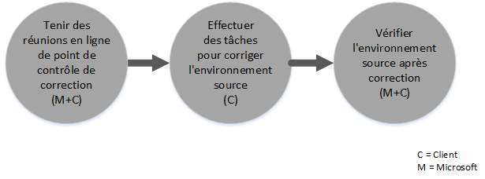

# Comment fonctionne l’offre du Centre FastTrack pour Intune
Si votre organisation est éligible à l'offre de service Microsoft Intune, vous pouvez travailler à distance avec des spécialistes Microsoft pour préparer votre environnement Microsoft Intune.

Microsoft Intune est la partie d’Enterprise Mobility Suite (EMS) de Microsoft qui fournit les fonctions de gestion de mobilité d’entreprise, y compris la gestion des appareils mobiles et la gestion des applications mobiles.  Vous pouvez utiliser Microsoft Intune pour permettre à vos employés d’être productifs sur des appareils mobiles par la mise en service et la configuration des appareils, et le déploiement d’applications mobiles.  Vous pouvez également utiliser Microsoft Intune pour mieux protéger vos données d’entreprise en analysant la compatibilité des appareils, en protégeant les données et applications mobiles, et en intégrant Azure AD pour contrôler l’accès aux services d’entreprise.

Pour savoir si votre organisation est éligible, consultez [Service FastTrack pour Intune](../Topic/FastTrack_Center_Benefit_for_Intune.md). Si vous souhaitez préparer votre environnement pour d’autres services Enterprise Mobility Suite, consultez [Offre du Centre FastTrack pour Enterprise Mobility Suite](../Topic/FastTrack_Center_Benefit_for_Enterprise_Mobility_Suite.md).

**Vous recherchez des informations sur Microsoft FastTrack pour Office 365 ? Consultez** [Service FastTrack pour Office 365](https://technet.microsoft.com/library/office-365-onboarding-benefit.aspx).

Cet article fournit les informations suivantes sur l'offre de service pour Microsoft Intune :

-   [Overview of the onboarding process](#overview_onboarding_process)

-   [Expectations for your source environment](#expectations_src_environ)

-   [Phases of the onboarding process](#phases_onboarding_process)

-   [Microsoft responsibilities](#microsoft_responsibilities) pour chaque phase

-   [Your responsibilities](#your_responsibilities) pour chaque phase

Voici ce à quoi vous pouvez vous attendre quand l'intégration est terminée :

-   Votre client de service en ligne Microsoft est créé.

-   Les titulaires d'une licence d'utilisation peuvent accéder au service Microsoft Intune en utilisant l'une des options d'identité suivantes :

    -   Identités de cloud (comptes de service en ligne Microsoft uniques).

    -   Identités synchronisées : comptes Microsoft Intune synchronisés à partir de votre annuaire Active Directory local avec Azure Active Directory Connect (services de synchronisation) :

        -   Pour les clients avec un environnement Active Directory comportant une seule forêt

        -   Pour les clients avec prise en charge d'une topologie Active Directory comportant plusieurs forêts

-   Identités fédérées -- Comptes Microsoft Intune :

    -   Synchronisés à partir d'Active Directory avec l'outil Microsoft Azure Active Directory Connect pour les clients avec une configuration de forêt Active Directory unique ou pour les clients avec une forêt de compte Active Directory unique (également appelée « forêt d'ouverture de session ») et une configuration de forêt de ressources Active Directory unique.

    -   Fédérés avec le rôle de services ADFS Windows Server 2012 R2 à partir de votre annuaire Active Directory local ou fédérés avec Active Directory Federation Services (ADFS) 2.0 ou version ultérieure à partir de votre annuaire Active Directory local.

## Vue d'ensemble du processus d'intégration
L'intégration présente deux composants majeurs :

-   **Fonctionnalités principales** : tâches requises pour la configuration du client et l'intégration à Azure AD, si nécessaire. Les fonctionnalités principales fournissent également la base pour l'intégration d'autres services éligibles.

-   **Intégration de service** : tâches requises pour configurer Microsoft Intune.

Le diagramme suivant décrit la séquence d’événements de l’utilisation de l’offre du centre FastTrack.

Le processus de base se présente comme suit :

-   Le centre FastTrack essaie de vous contacter dans les 30 jours suivant votre achat d’un plan éligible. Vous pouvez également demander de l’aide à partir du [Centre FastTrack](http://fasttrack.microsoft.com/) si vous êtes prêt à déployer ces services pour votre organisation. Pour demander de l’aide, connectez-vous au [Centre FastTrack](http://fasttrack.microsoft.com/), accédez au tableau de bord, sélectionnez le nom de votre entreprise, cliquez sur l’onglet Offres et sur le bouton de demande d’assistance pour Microsoft Intune, Azure Active Directory Premium ou Azure Rights Management Premium.

-   Le centre FastTrack vous apporte son aide pour les fonctionnalités principales, puis pour l’intégration de chaque service éligible.

L'assistance en matière d'intégration est assurée à distance par le personnel désigné de Microsoft :

-   Microsoft vous aide à distance pour de nombreuses activités d'intégration en fournissant des outils, de la documentation et des instructions.

-   L'assistance en matière d'intégration est fournie par le centre FastTrack, et est disponible pendant les heures normales de bureau d'une région donnée.

-   Elle est disponible dans les langues suivantes : chinois traditionnel, anglais, français, allemand, italien, japonais, portugais (Brésil) ou espagnol.

-   L’équipe Microsoft peut travailler directement avec vous ou votre représentant.

## Attentes concernant votre environnement source
Vous avez peut-être déjà des services dans votre environnement source que vous souhaitez migrer ou intégrer dans votre service Microsoft Intune. Pour certains services, l’offre du centre FastTrack pour Intune inclut une aide à la mise en place d’un certain niveau d’intégration à votre environnement source. Si l'intégration est requise, votre environnement source doit être à un niveau minimal pour cette application.

Le tableau suivant indique les conditions attendues dans votre environnement source existant pour l'intégration.

|Activité|Attente concernant l'environnement source|
|------------|---------------------------------------------|
|Fonctionnalités principales|Forêts Active Directory avec le niveau de forêts fonctionnel défini sur Windows Server 2008 ou version ultérieure, avec la configuration de forêts suivante :  -   Forêt Active Directory unique -   Plusieurs forêts Active Directory **Note:** Pour toutes les configurations à plusieurs forêts, le déploiement AD FS n’entre pas dans le cadre de l’offre du centre FastTrack.|
|Intégration de service  -   Microsoft Intune -   Microsoft Intune intégré à System Center Configuration Manager|Pour la gestion des appareils avec System Center Configuration Manager 2012 R2 ou version ultérieure connectés à Microsoft Intune, les administrateurs informatiques doivent suivre [Liste de vérification de l’administrateur : Configuration de Configuration Manager pour la gestion d’appareils mobiles à l’aide de Microsoft Intune](https://technet.microsoft.com/library/jj943763.aspx). **Note:** L'offre de service ne propose pas d'assistance pour la configuration ou la mise à niveau de System Center Configuration Manager vers la configuration minimale requise pour Microsoft Intune intégré à System Center Configuration Manager.|

## Phases du processus d'intégration
L'intégration comporte quatre phases principales :

-   Initier

-   Évaluer

-   Corriger

-   Activer

Pour connaître les tâches détaillées pour chaque phase, consultez les sections [Microsoft responsibilities](#microsoft_responsibilities) et [Your responsibilities](#your_responsibilities).

### Phase de lancement
Après avoir acheté le nombre et le type appropriés de licences, suivez les conseils indiqués dans le message électronique de confirmation d'achat pour associer ces licences à votre client existant ou nouveau. Le centre FastTrack vérifie votre éligibilité à l’offre du service. Microsoft essaie de vous contacter dans les 30 jours suivant votre achat d’un plan éligible. Vous pouvez également demander de l’aide à partir du [Centre FastTrack](http://fasttrack.microsoft.com/) si vous êtes prêt à déployer ces services pour votre organisation. Pour demander de l’aide, connectez-vous au [Centre FastTrack](http://fasttrack.microsoft.com/), accédez au tableau de bord, sélectionnez le nom de votre entreprise, cliquez sur l’onglet Offres et sur le bouton de demande d’assistance pour Microsoft Intune, Azure Active Directory Premium ou Azure Rights Management Premium.

Pendant cette phase, nous aborderons le processus d'intégration, vérifierons les données et organiserons une réunion de lancement.

### Phase d'évaluation
Une fois le processus d'intégration démarré, Microsoft travaillera avec vous pour évaluer votre environnement source et les conditions requises. Des outils seront exécutés afin d'évaluer votre environnement et Microsoft vous guidera tout au long de l'évaluation de vos navigateurs Internet, de vos systèmes d'exploitation clients, de votre service DNS, de votre réseau, de votre infrastructure et de votre système d'identité, afin de déterminer si des changements sont requis pour l'intégration. En fonction de votre configuration actuelle, nous vous fournirons un plan de correction qui adaptera votre environnement source aux conditions minimales requises pour la réussite de l'intégration à Microsoft Intune. Nous mettrons également en place des appels de point de contrôle appropriés pour la phase de correction.

### Phase de correction
Si nécessaire, vous effectuerez les tâches figurant dans le plan de correction dans votre environnement source de façon à pouvoir remplir les conditions requises pour l'intégration de chaque service.

Avant de commencer la phase d'activation, nous vérifierons ensemble les résultats des activités de correction pour nous assurer que vous pouvez continuer.

### Phase d'activation
Une fois toutes les activités de correction terminées, le projet passe à la configuration de l'infrastructure de base pour la consommation de services et à l'approvisionnement de Microsoft Intune.

**Phase d'activation - Fonctionnalités principales**

L'activation des fonctionnalités principales implique l'approvisionnement de services et l'intégration du client et de l'identité. Elle comprend également des étapes de création d'une base pour l'intégration de Microsoft Intune.

L'intégration de Microsoft Intune peut commencer une fois que l'activation des fonctionnalités principales est terminée.

**Phase d'activation – Microsoft Intune**

Pour Microsoft Intune, et en fonction de vos besoins en termes de gestion des applications et des appareils mobiles, nous vous guiderons afin que vous soyez prêt à utiliser Microsoft Intune pour gérer des appareils. Les étapes exactes dépendent de votre environnement source et peuvent inclure :

-   Attribution d’une licence aux utilisateurs finaux. Si nécessaire, nous vous aiderons également à activer les licences en volume pour votre client de service cloud Microsoft.

-   Configuration des identités qui doivent être utilisées par Microsoft Intune, en tirant parti des identités de cloud ou de votre annuaire Active Directory local.

-   Ajout d’utilisateurs à votre abonnement Microsoft Intune, définition des rôles d’administrateur informatique et création de groupes d’utilisateurs et d’appareils.

-   Selon vos besoins de gestion, configuration de l’autorité de gestion des appareils mobiles :

    -   Configurez Microsoft Intune comme autorité de gestion des appareils mobiles quand Microsoft Intune est votre seule solution de gestion des appareils mobiles ou en association avec la gestion des appareils mobiles pour Office 365.

    -   Si vous avez une implémentation existante de System Center Configuration Manager et que vous cherchez à étendre ses fonctionnalités de gestion avec Microsoft Intune, définissez Configuration Manager comme autorité de gestion des appareils mobiles.

        > [!NOTE]
        > Si vous cherchez seulement à tirer parti de la gestion des applications mobiles sur les appareils des utilisateurs finaux, les appareils partagés ou les appareils de type plein écran, la configuration d’une autorité de gestion des appareils mobiles n’est pas obligatoire.

-   Si la gestion des appareils mobiles figure dans vos objectifs, nous fournissons des conseils à propos des éléments suivants :

    -   Configuration de groupes de tests à utiliser pour valider les stratégies de gestion des appareils mobiles.

    -   Configuration des services et des stratégies de gestion des appareils mobiles, par exemple :

        -   Déploiement d’application pour chaque plateforme prise en charge par le biais des liens web ou des liens profonds.

        -   Stratégies d’accès conditionnel.

        -   Déploiement de profils de messagerie.

        -   Configuration de Microsoft Intune Exchange Connector, le cas échéant.

    -   Inscription au maximum de deux appareils de test de chaque [plateforme prise en charge](https://technet.microsoft.com/library/dn600287.aspx) dans le service Microsoft Intune ou Configuration Manager avec Microsoft Intune.

    -   Utilisation des rapports d’inventaire logiciel et matériel.

-   Si la gestion des applications mobiles figure dans vos objectifs, ou si vous souhaitez compléter votre solution de gestion des appareils mobiles tiers ou Microsoft existante avec des stratégies de gestion des applications mobiles, nous fournissons des conseils à propos des éléments suivants :

    -   Configuration des stratégies de gestion des applications mobiles pour chaque plateforme prise en charge.

    -   Configuration des stratégies d’accès conditionnel pour les applications gérées.

    -   Ciblage de groupes d’utilisateurs appropriés avec les stratégies de gestion des applications mobiles ci-dessus.

    -   Utilisation des rapports d’utilisation des applications gérées.

-   Si la gestion des PC figure dans vos objectifs, nous fournissons des conseils à propos des éléments suivants :

    -   Si nécessaire, installation du logiciel client Intune.

    -   Utilisation des rapports logiciels et matériels disponibles dans Intune.

## Responsabilités de Microsoft
Cette section décrit certaines responsabilités de Microsoft au cours du processus d'intégration.

### Général

-   Nous vous offrirons une assistance technique à distance pour les activités de configuration obligatoires, comme indiqué dans les descriptions détaillées des phases.

-   Nous fournirons la documentation disponible et les outils logiciels, les consoles d'administration ainsi que des scripts pour vous aider à réduire ou éliminer les tâches de configuration.

### Phase de lancement

-   Vous contacter dans les 30 jours suivant l'achat de licences éligibles pour un nouveau client.

-   Travailler avec vous pour commencer l’intégration.

-   Définir les services éligibles que vous souhaitez intégrer.

### Phase d'évaluation

-   Fournir un aperçu administratif.

-   Fournir des conseils à propos des éléments suivants :

    -   DNS, réseau et besoins en infrastructure.

    -   Besoins du client (navigateur Internet, système d'exploitation client et besoins des services).

    -   Identité utilisateur et approvisionnement.

    -   Activation des services éligibles qui ont été achetés et définis comme faisant partie de l'intégration.

-   Établir la chronologie des activités de correction.

-   Fournir une liste de contrôle de correction.

### Phase de correction

-   Tenir des téléconférences avec vous en fonction du calendrier convenu, afin d'examiner la progression des activités de correction.

-   Vous aider à exécuter des outils permettant d'identifier et de résoudre les problèmes, et vous aider à interpréter les résultats.

### Phase d'activation
Fournir des conseils à propos des éléments suivants :

-   Activation de votre client de service en ligne Microsoft.

-   Configuration des protocoles TCP/IP et des ports de pare-feu.

-   Configuration du service DNS pour les services éligibles.

-   Validation de la connectivité aux services en ligne Microsoft.

-   Pour un environnement à forêt unique :

    -   Installation d'un serveur de synchronisation d'annuaires entre vos services de domaine Active Directory et les services en ligne Microsoft éligibles, si nécessaire.

    -   Configuration de la synchronisation de mot de passe (hachage de mot de passe) sur Microsoft Intune (Azure Active Directory) avec l’outil Azure Active Directory Connect.

        > [!NOTE]
        > Le développement et l'implémentation des extensions de règles personnalisées sont hors de portée.

-   Pour une forêt unique lorsque les identités fédérées sont ciblées : Installation et configuration des services AD FS (Active Directory Federation Services) pour l'authentification de domaine local avec Microsoft Intune dans une configuration à site unique et à tolérance de panne, si nécessaire.

    > [!NOTE]
    > Pour toutes les configurations à plusieurs forêts, les déploiements AD FS sont hors de portée.

-   Test de la fonctionnalité d'authentification unique si elle est déployée.

#### Phase d’activation – Microsoft Intune
Fournir des conseils à propos des éléments suivants :

-   Attribution d’une licence aux utilisateurs finaux. Si nécessaire, nous vous aiderons également à activer les licences en volume pour votre client de service cloud Microsoft.

-   Configuration des identités qui doivent être utilisées par Microsoft Intune, en tirant parti des identités de cloud ou de votre annuaire Active Directory local.

-   Ajout d’utilisateurs à votre abonnement Microsoft Intune, définition des rôles d’administrateur informatique et création de groupes d’utilisateurs et d’appareils.

-   Selon vos besoins de gestion, configuration de l’autorité de gestion des appareils mobiles :

    -   Configurez Microsoft Intune comme autorité de gestion des appareils mobiles quand Microsoft Intune est votre seule solution de gestion des appareils mobiles ou en association avec la gestion des appareils mobiles pour Office 365.

    -   Si vous avez une implémentation existante de System Center Configuration Manager et que vous cherchez à étendre ses fonctionnalités de gestion avec Microsoft Intune, définissez Configuration Manager comme autorité de gestion des appareils mobiles.

        > [!NOTE]
        > Si vous cherchez seulement à tirer parti de la gestion des applications mobiles sur les appareils des utilisateurs finaux, les appareils partagés ou les appareils de type plein écran, la configuration d’une autorité de gestion des appareils mobiles n’est pas obligatoire.

-   Si la gestion des appareils mobiles figure dans vos objectifs, nous fournissons des conseils à propos des éléments suivants :

    -   Configuration de groupes de tests à utiliser pour valider les stratégies de gestion des appareils mobiles.

    -   Configuration des services et des stratégies de gestion des appareils mobiles, par exemple :

        -   Déploiement d’application pour chaque plateforme prise en charge par le biais des liens web ou des liens profonds.

        -   Stratégies d’accès conditionnel.

        -   Déploiement de profils de messagerie.

        -   Configuration de Microsoft Intune Exchange Connector, le cas échéant.

    -   Inscription au maximum de deux appareils de test de chaque plateforme prise en charge dans le service Microsoft Intune ou Configuration Manager avec Microsoft Intune.

    -   Utilisation des rapports d’inventaire logiciel et matériel.

-   Si la gestion des applications mobiles figure dans vos objectifs, ou si vous souhaitez compléter votre solution de gestion des appareils mobiles tiers existante avec des stratégies de gestion des applications mobiles, nous fournissons des conseils à propos des éléments suivants :

    -   Configuration des stratégies de gestion des applications mobiles pour chaque plateforme prise en charge.

    -   Configuration des stratégies d’accès conditionnel pour les applications gérées.

    -   Ciblage de groupes d’utilisateurs appropriés avec les stratégies de gestion des applications mobiles ci-dessus.

    -   Utilisation des rapports d’utilisation des applications gérées.

-   Si la gestion des PC figure dans vos objectifs, nous fournissons des conseils à propos des éléments suivants :

    -   Si nécessaire, installation du logiciel client Intune.

    -   Utilisation des rapports logiciels et matériels disponibles dans Intune.

## Vos responsabilités
Cette section décrit certaines de vos responsabilités au cours du processus d'intégration.

### Général

-   Toutes les améliorations apportées à votre client de service en ligne Microsoft et intégrations à celui-ci dépassant les options configurables répertoriées dans cet article.

-   Gestion globale des projets et des programmes concernant vos ressources.

-   Communications avec l'utilisateur final, documentation, formation et gestion des modifications.

-   Documentation et formation destinées au support technique.

-   Production de rapports, présentations ou comptes rendus de réunion spécifiques à votre organisation.

-   Création de documentation architecturale et technique spécifique à votre organisation.

-   Conception, approvisionnement, installation et configuration du matériel et de la mise en réseau.

-   Approvisionnement, installation et configuration de logiciels.

-   Configuration, emballage et distribution de logiciels clients obligatoires pour Microsoft Intune.

-   Activation d'appareils mobiles.

-   Configuration, analyse, validation de la bande passante, test et surveillance du réseau.

-   Gestion d'un processus d'approbation de gestion des modifications techniques et création de la documentation associée.

-   Spécification et définition de stratégies de groupe pour la gestion des utilisateurs, des postes de travail et du serveur.

-   Modification de votre modèle opérationnel et des guides d'utilisation.

-   Configuration de l'authentification multifacteur.

-   Désaffectation et suppression d'environnements sources (tels que des solutions de gestion d'autres appareils ou PC).

-   Construction et maintenance de votre environnement de test.

-   Installation de Service Packs et d'autres mises à jour obligatoires sur les serveurs d'infrastructure.

-   Fourniture et configuration de tous les certificats SSL publics.

-   Écriture de la déclaration des conditions d’utilisation de l’organisation à configurer et afficher sur les portails de la société Microsoft Intune accessibles aux utilisateurs finaux.

### Phase de lancement

-   Travailler avec l’équipe Microsoft pour commencer l’intégration des services éligibles.

-   Participer à la réunion de lancement, gérer et diriger les participants de votre organisation, et confirmer la chronologie des corrections.

### Phase d'évaluation

-   Identifier les parties prenantes appropriées (dont un chef de projet) pour effectuer les activités d'évaluation nécessaires.

-   Si vous le souhaitez, partager votre écran avec Microsoft si vous avez besoin de conseils lors de l'exécution des outils d'évaluation dans votre environnement ou votre abonnement Microsoft Intune.

-   Participer aux réunions pour la création de la liste de contrôle de correction et contribuer au plan global, y compris sur des sujets tels que l'infrastructure, le réseau, l'administration, la préparation de la synchronisation d'annuaires, la sécurité du réseau et les identités fédérées.

-   Participer aux réunions pour définir l'approche d'approvisionnement utilisateur.

-   Participer aux réunions pour planifier la configuration du service en ligne.

-   Créer un plan de prise en charge pour la préparation à la migration.

### Phase de correction

-   Exécuter les étapes obligatoires pour effectuer les activités de correction identifiées durant la phase d'évaluation.

-   Participer aux réunions de point de contrôle.

### Phase d'activation

-   Si vous le souhaitez, partager votre écran avec Microsoft si vous avez besoin de conseils lors de l'apport de modifications à votre environnement ou votre abonnement au service en ligne Microsoft.

-   Gérer les ressources de manière appropriée.

-   Configurer les éléments liés au réseau selon les recommandations de Microsoft.

-   Effectuer la préparation des annuaires et configurer la synchronisation d'annuaires selon les recommandations de Microsoft.

-   Configurer les éléments d'infrastructure liés à la sécurité (tels que les ports de pare-feu) selon les recommandations de Microsoft.

-   Implémenter l'infrastructure cliente appropriée.

-   Implémenter une approche d'approvisionnement utilisateur selon les recommandations de Microsoft.

-   Activer divers services selon les recommandations de Microsoft.

-   Collaborer avec Microsoft pour terminer l'intégration de tous les services éligibles dans les 12 mois suivant le début de l'intégration.

-   Quand vous activez la gestion des appareils mobiles ou des PC avec Microsoft Intune, utilisez des appareils de test lors de l'activation des stratégies de gestion via Microsoft Intune. Si les appareils de test ne sont pas disponibles, les clients sont chargés de la sauvegarde et, si nécessaire, de la restauration de tout le contenu des appareils utilisés au cours de la phase d'activation Microsoft Intune.

-   Sélection de deux applications au maximum pour chaque plateforme prise en charge Microsoft Intune qui peut être déployée par le biais des liens web ou des liens profonds.

-   Gestion, configuration et application de stratégies de sécurité au-delà de celles utilisées pour tester les fonctionnalités et la configuration de ligne de base des services Microsoft Intune.

## Vous souhaitez en savoir plus ?
Consultez [Microsoft Intune](http://www.microsoft.com/en-us/server-cloud/products/microsoft-intune/default.aspx) et [Enterprise Mobility Suite](http://www.microsoft.com/en-us/server-cloud/products/enterprise-mobility-suite/default.aspx).

